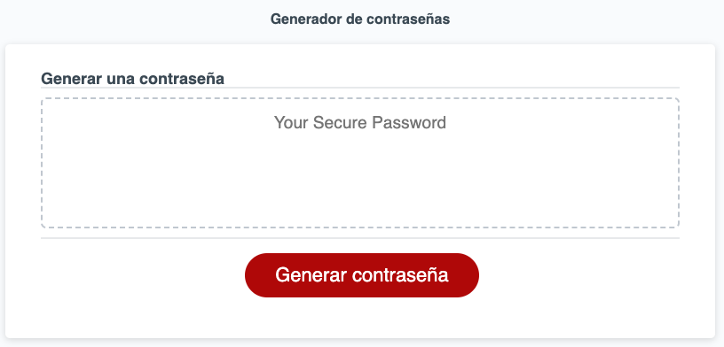

# Password Generator

```
This is an interactive password generator, press the button "Generate Password" and indicate the conditions in the prompts:

1. Choose a length between 8 to 128 characters.
2. Indicate if you want to include Uppercase letters in your password.
3. Indicate if you want to include Lowercase letters in your password.
4. Indicate if you want to include numbers in your password.
5. Indicate if you want to include special characters in your password.

Ready, get your new password!
```


- Visit the Password Generator App: 
[Password Generator](https://jaime-a-esquivel-a.github.io/PasswordGenerator/Develop/index.html)

